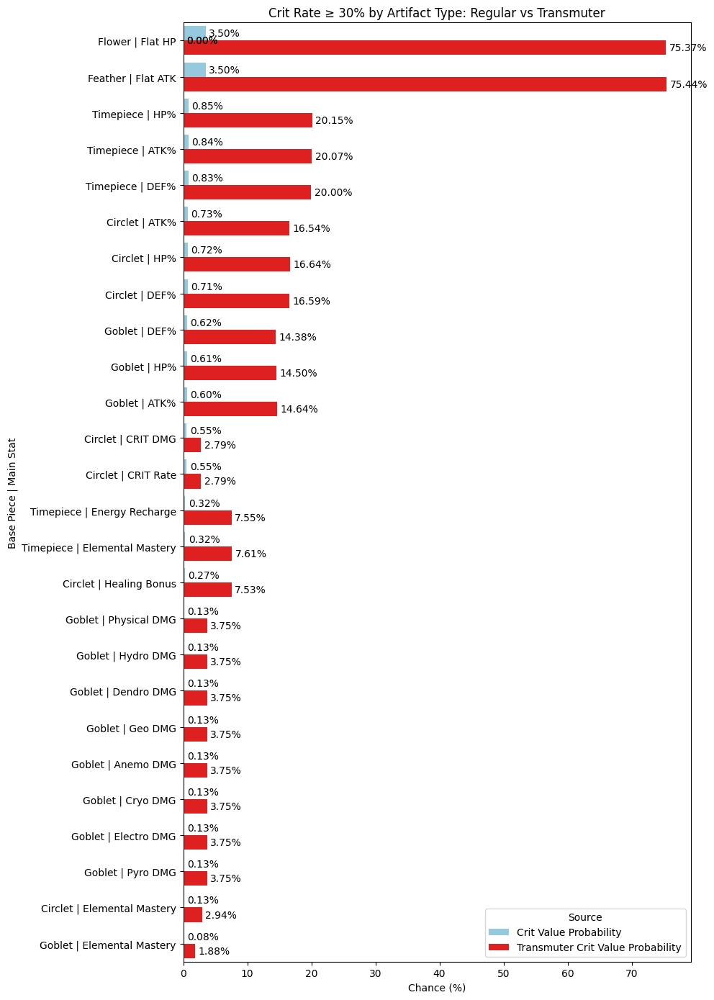

# genshin-artifact
This project is to determine the efficiency of obtaining genshin artifacts via the artifact transmuter. Specifically, the project will focus on comparing the transmuter versus regular farming artifacts for the 5.5 update, in which the transmuter received a major update.

# Project Structure:
```text
genshin-artifact/
├── Artifact.py          # Artifact Class with Transmuter child
├── main.ipynb           # Main file with data creation and manipulation, reasoning, and displays.
├── README.md            # This file
└── requirements.rxr     # Required modules
```

# Overview
This project models the Genshin Impact artifact system and artifact transmuter. 

It includes:

- Artifact class: 
    - Allows for the random generation of artifacts, including:
        - Slot (e.g., Flower, Feather, Goblet, etc.)
        - Main stat, constrained by slot and probability
        - 4 substats drawn from a valid pool with correct constraints (e.g., no duplicates, main stat exclusion)
        - Random roll values for each substat
        - Follows all documented probability rules as sourced from the Genshin Wiki
- Transmuter class (inherits from Artifact):
    - Simulates the Mystic Offering system
    - Takes into account the two guaranteed rolls into selected affixes (e.g., CRIT Rate or CRIT DMG)
    - Adjusts probability distribution and outcome quality accordingly
The simulation also provides:
- Analytical tools to estimate average time (in domain runs or days) needed to obtain high-quality artifacts (e.g., Crit Value ≥ 30)
- Comparison between normal domain farming and transmutation strategy
- Visualizations using matplotlib and seaborn for chance, efficiency, and time-cost comparisons
This project can be used to:

- Evaluate optimal artifact farming strategies
- Simulate thousands of runs to estimate drop quality distributions
- Explore trade-offs between farming and transmuting in late-game optimization

# How to run
```
pip install -r requirements.txt
```
Then open main.ipynb file on Jupyter Notebook/IDE

# Visuals/Findings



# Final Conclusions
- **Use the transmuter whenever possible**. Players can get a limited amount of elixirs from the game without sacrificing.
- **Always transmute Goblets** as they have the most signifcant difference in chance percentage.
- **Transmuter is good, BUT the lack of elixirs heavily weigh down its value**
- **Skip the elemental mastery goblets / circlets** when dealing with crit value as they do not normally go together.
- Also, **CRIT VALUE IS NOT EVERYTHING WHEN EVALUATING AN ARTIFACT.** Please consider other stats as well, such as ATK%, Energy Recharge, and HP% (for HP scalers).


# Features to Improve
- Write everything in C++ for faster/more simulations for Monte Carlo
- Use more statistics to calculate the probabilities instead of Monte Carlo
- Re-check calculations, clean up data more for presentability

# Requirements
```
pip install -r requirements.txt
```

# Sources
- iWinToLoseGaming: https://www.youtube.com/watch?v=elHjyqdx-Uk&t=282s
- Genshin Impact fandom Wiki: https://genshin-impact.fandom.com/wiki/Artifact
- KeqingMains: https://keqingmains.com/misc/artifacts/
- Sevy: https://www.youtube.com/watch?v=yeoNtv8KESw


# Contact
Maintained by Kevin Nguyen. 


